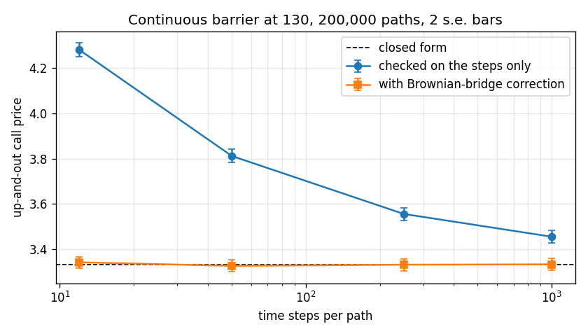

# cpp-option-pricing

[](https://github.com/aakashbansalgit/cpp-option-pricing/actions/workflows/tests.yml)

A Brownian-bridge correction prices a continuously monitored barrier option without bias at 12 time steps, where checking only on the steps is still 3.7% high at 1,000.


Option pricing in C++17: a Monte Carlo pricer for barrier options with variance reduction and a Brownian-bridge correction, and a trinomial tree with American exercise and Richardson extrapolation. Every number below is checked against a closed form. It started as two programs for IE 523 (Financial Computing) at the University of Illinois, which are still here in `barrier-options/` and `trinomial-tree/`, and grew into the library in `lib/`.

## Barrier options by Monte Carlo

`lib/pricing.cpp`, `mc_up_out_call`. An up-and-out call dies if the stock ever touches the barrier. A simulation only sees the stock on its time steps, so a path can cross the barrier and come back between two steps without being caught. Checking only on the steps therefore overprices a continuously monitored barrier.

The fix is the Brownian bridge. Given where the log price starts and ends a step, the probability that it touched the barrier in between is exp(-2 (ln H - x_i)(ln H - x_{i+1}) / (sigma^2 dt)), so each path carries the probability it survived every step rather than a yes or no.

Up-and-out call, S = K = 100, barrier 130, r = 5%, sigma = 20%, one year, 200,000 paths. The closed form is 3.3329.

| Steps per path | Checked on steps | With Brownian bridge |
|---|---|---|
| 12 | 4.280 ± 0.016 | 3.342 ± 0.013 |
| 50 | 3.812 ± 0.015 | 3.327 ± 0.013 |
| 250 | 3.556 ± 0.014 | 3.332 ± 0.013 |
| 1,000 | 3.455 ± 0.014 | 3.333 ± 0.013 |

The naive estimate is still 3.7% high at 1,000 steps, and the bias falls only with the square root of the step count: quadrupling the steps halves it. The bridge estimate is within one standard error of the closed form at every step count, including 12.

Variance reduction at 100,000 paths and 50 steps, with the bridge:

| Method | Standard error | Variance cut |
|---|---|---|
| Plain | 0.0186 | 1.0x |
| Antithetic paths | 0.0110 | 2.9x |
| Vanilla call as control variate | 0.0184 | 1.0x |
| Both | 0.0100 | 3.5x |

The control variate does almost nothing, and that is the lesson. A control only helps when it moves with the target, and the paths where a vanilla call pays most are exactly the ones that ran up through the barrier and paid the barrier option nothing. Antithetic paths help because pairing each path with its mirror image cancels much of the noise in where the stock ends up.

## Trinomial tree

`trinomial`, a recombining tree in log price with steps of sigma sqrt(3 dt) and branch probabilities that match the mean and variance of ln S over each step, with an option for American exercise. Error against Black-Scholes for an at-the-money call, and against a 20,000-step tree for an American put:

| Steps | 100 | 200 | 400 | 800 | 1,600 |
|---|---|---|---|---|---|
| European call | -0.0188 | -0.0094 | -0.0047 | -0.0023 | -0.0012 |
| European call, Richardson | 2.2e-5 | 5.6e-6 | 1.4e-6 | 3.4e-7 | 8.6e-8 |
| American put | -0.0187 | -0.0089 | -0.0044 | -0.0022 | -0.0010 |

The plain tree converges at first order, with an error so close to a constant over the number of steps that Richardson extrapolation, 2 V(2n) - V(n), removes it and leaves second-order convergence: 100 extrapolated steps beat 1,600 plain ones by a factor of fifty. For the American put the same trick brings the error to about 1e-4, the size of the reference tree's own error.

The original coursework version of this tree used binomial probabilities on a trinomial grid, which gave the middle branch zero weight, doubled the variance per step and priced this call at 17.71. `trinomial-tree/` keeps that program with the probabilities fixed; it now gives 10.4318 at 100 steps, the same as the library.

## Building and running

```
cmake -B build && cmake --build build --config Release
build/tests                 # checks against closed forms
build/study results         # writes the CSV files behind the tables
python plot_results.py      # figures/ from those CSVs
```

On Windows the executables land in `build/Release/`. Without CMake, any C++17 compiler works directly, for example `g++ -O2 -std=c++17 lib/pricing.cpp tests/test_main.cpp -o tests`. I build with MSVC through CMake. `figures/barrier_monitoring.png` and `figures/trinomial_convergence.png` plot the two studies.
